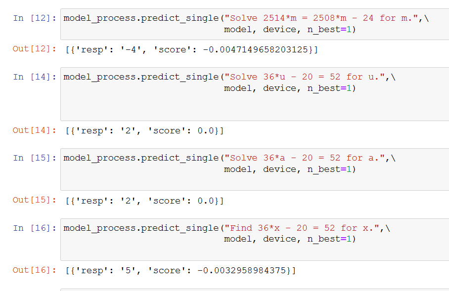
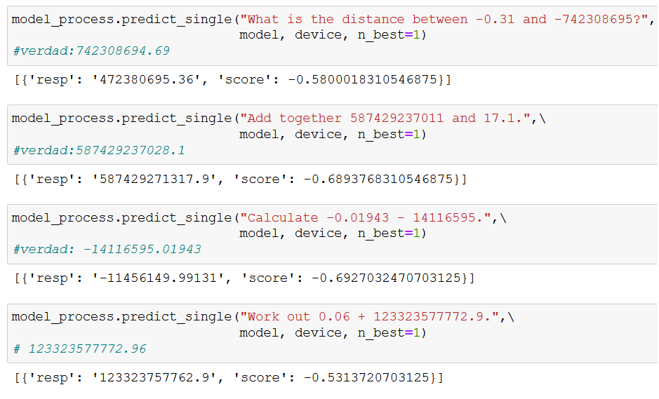

# Atención sobre lenguaje matemático usando transformers

## Equipo 1
   - [Jesús Andrés Torrejón León](https://github.com/JesusATL)
   - [Jordi Joel Bardales Rojas](https://github.com/jbardalesr)
   - [Walter Jesús Felipe Tolentino](https://github.com/felipeturing)

## Objetivo
El objetivo principal es comprobar la capacidad que tienen los modelos basados en arquitecturas transformers para poder resolver tareas relacionadas con el lenguaje matemático.

## Resumen

Los transformers son una de las arquitecturas de aprendizaje automático con mayor número de aplicaciones. En este trabajo buscamos comprobar la capacidad que tiene este tipo de modelos para poder realizar tareas que impliquen un cierto razonamiento matemático. Para ello implementamos 2 modelos, uno de ellos se encargará de resolver ecuaciones lineales de una variable y el segundo intenta resolver adiciones y sustracciones que le son expresadas en lenguaje natural sin mucho éxito.

## Dataset
El dataset completo de problemas matematicos tiene un peso de 2gb comprimido (7gb al descomprimir) auqnue se utilizo una peuqeña parte del mismo.

https://console.cloud.google.com/storage/browser/_details/mathematics-dataset/mathematics_dataset-v1.0.tar.gz

## Modelos
Los modelos entrenados pesan 500mb cada uno por lo que no es posible subirlos al repositorio, los archivos fueron subidos al los siguientes enlaces.

Modelo 1 : https://drive.google.com/file/d/10iRGBjshW6euJqtFDeCZFZz9yMW1XfXK/view?usp=sharing

Modelo 2 : https://drive.google.com/file/d/1T9yJnPX2--ike_bxtPdyyOFj87G5-eXo/view?usp=sharing

### NOTA:
El cuaderno de entrenamiento "Cuaderno de entrenamiento 1.ipynb" y "Cuaderno de entrenamiento 2.ipynb" asi como los cuadernos de prueba "pruebasPrimerModelo.ipynb" y "pruebasSegundoModelo.ipynb" fueron ejecutados localmente en una computadora con gpu luego de un largo proceso de configuracion. 

## Resultados
### Predicciones realizadas por el modelo entrenado sobre algebra__linear_1d.txt (EASY)

### Predicciones realizadas por el modelo entrenado sobre algebra__linear_1d.txt (HARD)

